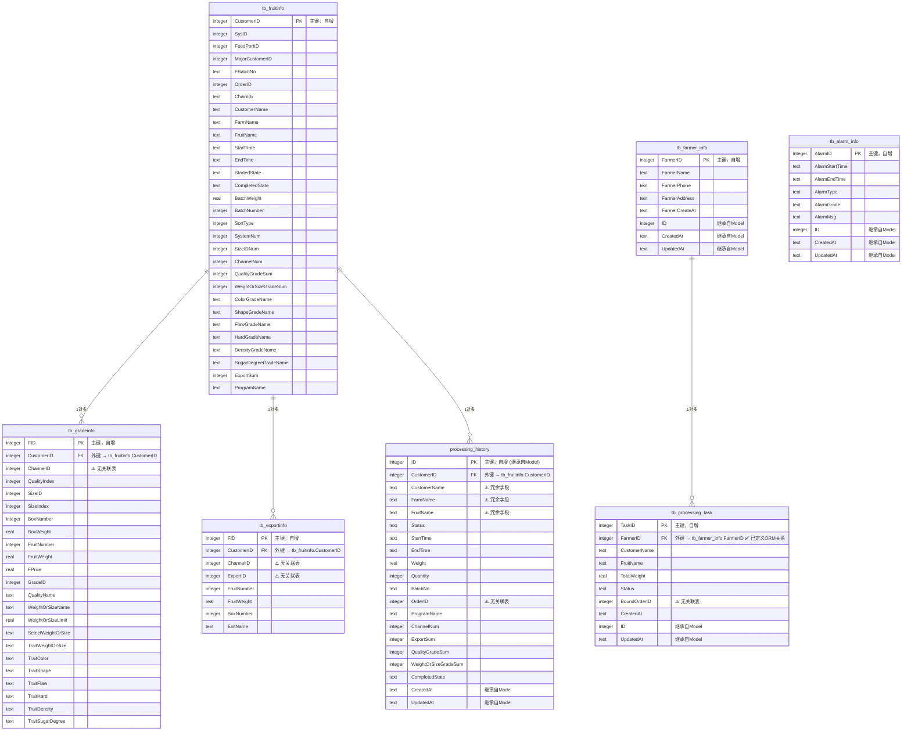
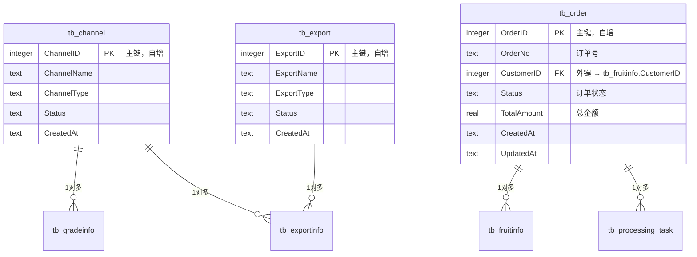

# 数据库ER图 (Mermaid格式)

## 实体关系图

## 建议补充的表（缺失）

## 问题总结

### 🔴 严重问题
1. **外键约束缺失**：虽然代码中有外键字段，但数据库层面没有外键约束
2. **字段命名混淆**：`CustomerID` 在不同表中含义不同
3. **数据冗余**：ProcessingHistory 中重复存储了 FruitInfo 的字段

### 🟡 中等问题
1. **缺少基础数据表**：ChannelID, ExportID, OrderID 没有对应的主表
2. **时间字段类型**：所有时间都是 TEXT，应该考虑使用 DATETIME

### 🟢 建议优化
1. 添加基础数据表（Channel, Export, Order）
2. 明确 CustomerID 的含义或重命名
3. 减少 ProcessingHistory 的冗余字段
4. 考虑添加数据库层面的外键约束

