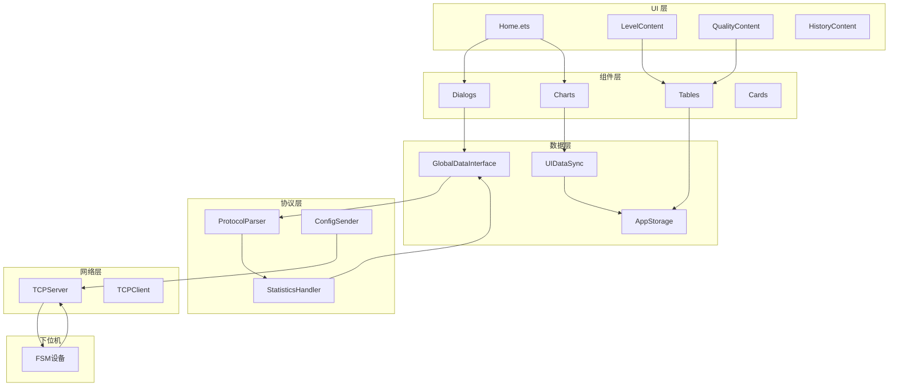
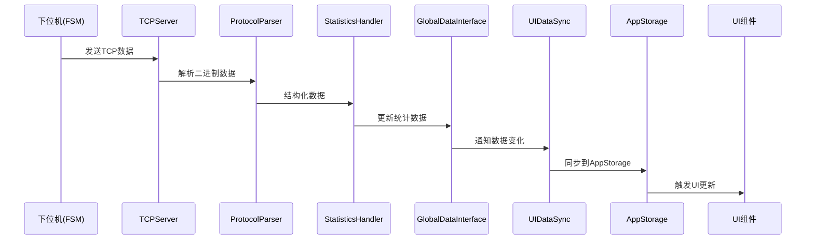
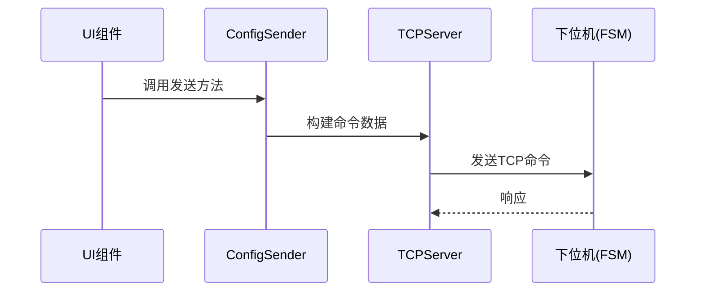
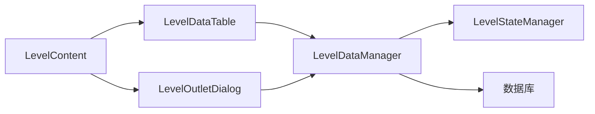
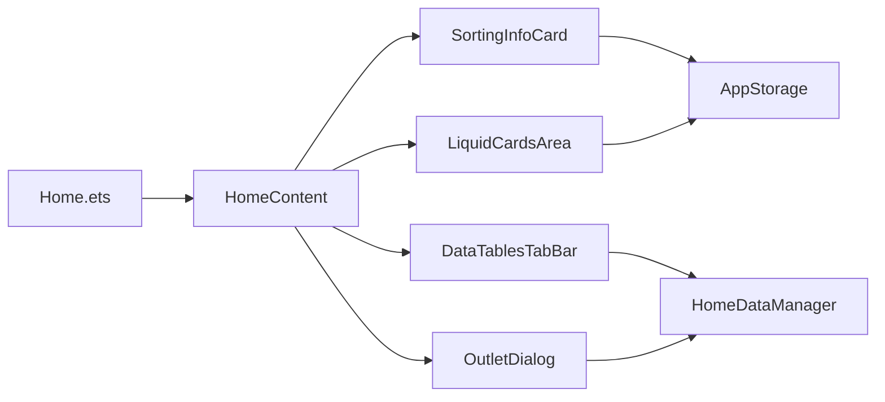

# 项目架构图

## 整体架构



## 数据流向

### 下位机 → UI（接收数据）



### UI → 下位机（发送命令）



## 模块关系

### 等级设置功能模块



### 主页功能模块



## 关键接口

### GlobalDataInterface 接口

```
GlobalDataInterface (单例)
├── updateStatistics()      // 更新统计数据
├── updateWeightInfo()       // 更新重量信息
├── updateGradeInfo()        // 更新等级信息
├── getGlobalData()          // 获取全局数据
└── addDataChangeListener()  // 注册数据变化监听
```

### UIDataSync 职责

```
UIDataSync (单例)
├── 监听 GlobalDataInterface 变化
├── 同步数据到 AppStorage
└── 格式化数据供UI使用
```

### ConfigSender 职责

```
ConfigSender (单例)
├── sendClearData()          // 发送数据清零
├── sendSaveData()           // 发送保存数据
├── sendWeightInfoOn()       // 开启重量信息
└── 其他配置命令...
```

## 目录结构关系

```
entry/src/main/ets/
├── pages/              ← UI页面层
│   ├── home/          ← 主页模块
│   ├── level/         ← 等级页面模块
│   └── quality/       ← 品质页面模块
│
├── components/         ← 可复用组件层
│   ├── dialogs/       ← 对话框组件
│   ├── charts/        ← 图表组件
│   └── tables/        ← 表格组件
│
├── protocol/           ← 协议层（核心）
│   ├── GlobalDataInterface.ets
│   ├── ProtocolParser.ets
│   ├── StatisticsHandler.ets
│   └── UIDataSync.ets
│
├── utils/              ← 工具层
│   └── network/        ← 网络工具
│       └── tcp/        ← TCP通信
│
└── database/           ← 数据库层
    └── services/       ← 数据服务
```

## 学习路径建议

### 理解顺序

1. **先看整体**：理解三层架构（UI → 数据 → 网络）
2. **再看数据流**：理解数据如何从下位机到UI
3. **最后看模块**：理解具体功能模块的实现

### 重点模块

- **protocol/** - 核心协议层，必须理解
- **utils/network/tcp/** - 网络通信，必须理解
- **pages/home/** - 主页功能，重要
- **components/dialogs/** - 对话框，常用

### 可以暂时忽略

- **database/** - 数据库，功能稳定后看
- **utils/theme/** - 主题系统，不影响功能
- **utils/charts/** - 图表组件，用的时候再看
