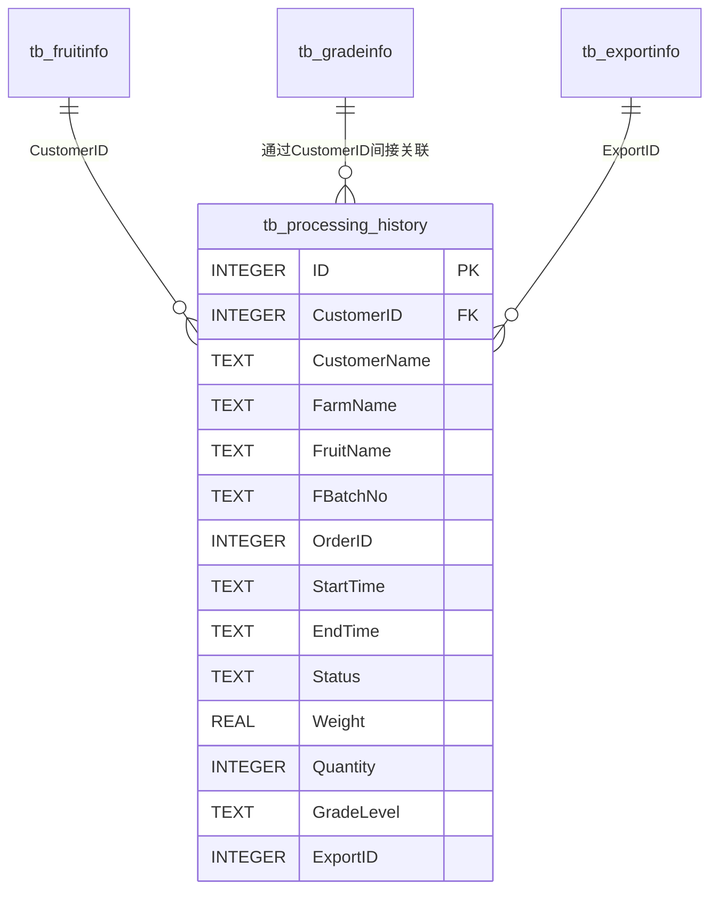

# 历史加工数据表设计方案

## 一、设计背景

基于当前水果分选系统的业务需求，需要设计一个历史加工数据表(`tb_processing_history`)，用于记录和追溯每次加工批次的完整信息，支持数据查询、统计分析和导出功能。

## 二、表结构设计

### 表名：tb_processing_history（历史加工信息表）

**说明**：存储水果加工历史记录数据，支持按时间、客户、农场、水果品种等多维度查询和统计。

**字段数**：25个

### 完整字段列表

| 序号 | 字段名 | 数据类型 | 默认值 | 可空 | 说明 | 优先级 |
|------|--------|----------|--------|------|------|--------|
| **基本信息** |
| 1 | ID | INTEGER | 自增 | NO | 主键ID | 必需 |
| 2 | CustomerID | INTEGER | - | YES | 客户ID(关联tb_fruitinfo.CustomerID) | 高 |
| 3 | CustomerName | TEXT | - | NO | 客户名称 | 必需 |
| 4 | FarmName | TEXT | - | NO | 农场名称 | 必需 |
| 5 | FruitName | TEXT | - | NO | 水果名称/品种 | 必需 |
| **批次订单信息** |
| 6 | FBatchNo | TEXT | - | YES | 批次号(用于追溯) | 高 |
| 7 | OrderID | INTEGER | - | YES | 订单ID(关联订单系统) | 高 |
| 8 | ProgramName | TEXT | - | YES | 使用的分选程序名称 | 中 |
| **时间信息** |
| 9 | StartTime | TEXT | - | NO | 加工开始时间(YYYY-MM-DD HH:mm:ss) | 必需 |
| 10 | EndTime | TEXT | - | YES | 加工结束时间(YYYY-MM-DD HH:mm:ss) | 必需 |
| 11 | ProcessDuration | INTEGER | - | YES | 加工时长(分钟，可计算得出) | 中 |
| 12 | CreatedAt | TEXT | CURRENT_TIMESTAMP | YES | 记录创建时间 | 低 |
| 13 | UpdatedAt | TEXT | CURRENT_TIMESTAMP | YES | 记录更新时间 | 低 |
| **状态信息** |
| 14 | Status | TEXT | '待开始' | NO | 加工状态(已完成/进行中/待开始) | 必需 |
| **数量重量信息** |
| 15 | Weight | REAL | - | YES | 总重量(千克) | 必需 |
| 16 | Quantity | INTEGER | - | YES | 水果总数量(个) | 必需 |
| 17 | BatchWeight | REAL | - | YES | 批次重量(吨) | 高 |
| 18 | BoxNumber | INTEGER | - | YES | 包装箱数 | 中 |
| **等级品质信息** |
| 19 | GradeLevel | TEXT | - | YES | 等级(A级/B级/C级/D级等) | 高 |
| 20 | QualityGrade | TEXT | - | YES | 品质等级名称 | 中 |
| **出口信息** |
| 21 | ExportID | INTEGER | - | YES | 出口编号 | 高 |
| 22 | ExportName | TEXT | - | YES | 出口名称 | 中 |
| **系统管理信息** |
| 23 | SystemNum | INTEGER | - | YES | 系统编号(用于多系统环境) | 中 |
| 24 | Operator | TEXT | - | YES | 操作员姓名 | 低 |
| 25 | Remarks | TEXT | - | YES | 备注信息 | 低 |

## 三、索引设计

为优化查询性能，建议创建以下索引：

| 索引名 | 字段 | 类型 | 说明 |
|--------|------|------|------|
| idx_processing_history_start_time | start_time | 升序 | 优化时间范围查询 |
| idx_processing_history_end_time | end_time | 升序 | 优化时间范围查询 |
| idx_processing_history_customer_name | customer_name | 升序 | 优化客户查询 |
| idx_processing_history_farm_name | farm_name | 升序 | 优化农场查询 |
| idx_processing_history_fruit_name | fruit_name | 升序 | 优化水果品种查询 |
| idx_processing_history_status | status | 升序 | 优化状态筛选 |
| idx_processing_history_f_batch_no | f_batch_no | 升序 | 优化批次号查询 |
| idx_processing_history_customer_id | customer_i_d | 升序 | 优化关联查询 |
| idx_processing_history_order_id | order_i_d | 升序 | 优化订单查询 |
| idx_processing_history_id_desc | id | 降序 | 优化最新记录查询 |

## 四、数据类型映射说明

### SQLite vs MySQL 类型映射

| MySQL 类型 | SQLite 类型 | 说明 |
|-----------|------------|------|
| INT / BIGINT | INTEGER | 整数类型 |
| VARCHAR(n) / TEXT | TEXT | 文本类型,SQLite无长度限制 |
| DECIMAL(m,n) | REAL | 浮点数类型 |
| DATETIME | TEXT | 日期时间,存储为ISO 8601格式 |

### 字段命名规则

- **TypeScript 代码**: 使用 PascalCase (如 `CustomerID`, `FruitName`)
- **数据库列名**: 使用 snake_case (如 `customer_i_d`, `fruit_name`)
- **ORM 自动转换**: 框架会自动处理命名转换

**特殊规则:**
- 以 `ID` 结尾的字段转换为 `_i_d` (如 `CustomerID` -> `customer_i_d`)
- 普通驼峰命名转换为下划线分隔 (如 `FruitName` -> `fruit_name`)

## 五、与现有表的关联关系



## 六、业务场景支持

### 6.1 查询场景
- ✅ 按时间范围查询历史加工记录
- ✅ 按客户名称/农场名称/水果品种查询
- ✅ 按加工状态筛选(已完成/进行中/待开始)
- ✅ 按批次号追溯加工记录
- ✅ 按等级统计加工数据

### 6.2 统计分析场景
- ✅ 统计某时间段内的加工总量
- ✅ 统计各等级水果的数量和重量
- ✅ 统计各客户的加工数据
- ✅ 分析加工效率(通过ProcessDuration)

### 6.3 导出场景
- ✅ 导出CSV/Excel格式的历史加工报表
- ✅ 支持合并导出和批量导出
- ✅ 导出字段包含：加工时间、结束时间、加工品种、总重量、客户名称、农场名称、等级、出口编号等

## 七、实现建议

### 7.1 分阶段实现

**第一阶段(核心功能)**
- 实现必需字段(8个): ID, CustomerName, FarmName, FruitName, StartTime, EndTime, Status, Weight, Quantity
- 创建基础索引
- 实现基本的增删改查功能

**第二阶段(扩展功能)**
- 添加高优先级字段(7个): CustomerID, FBatchNo, OrderID, GradeLevel, ExportID, ExportName, BatchWeight
- 完善索引
- 实现关联查询和统计分析

**第三阶段(完善功能)**
- 添加中低优先级字段
- 实现审计功能(CreatedAt, UpdatedAt)
- 添加操作员追踪和备注功能

### 7.2 数据迁移方案

如果需要从现有的`ProcessingHistory`表迁移到新表结构：

```sql
-- 创建新表
CREATE TABLE tb_processing_history_new (...);

-- 迁移现有数据
INSERT INTO tb_processing_history_new 
  (customer_name, farm_name, fruit_name, status, start_time, end_time, weight, quantity)
SELECT 
  customer_name, farm_name, fruit_name, status, start_time, end_time, weight, quantity
FROM processing_history;

-- 重命名表
ALTER TABLE processing_history RENAME TO processing_history_backup;
ALTER TABLE tb_processing_history_new RENAME TO tb_processing_history;
```

## 八、性能优化建议

1. **索引优化**: 根据实际查询频率调整索引，避免过多索引影响写入性能
2. **分页查询**: 大数据量查询时使用分页(LIMIT + OFFSET)
3. **异步处理**: 使用TaskPool和DatabaseQueueManager避免阻塞UI线程
4. **批量操作**: 批量插入/更新时使用事务提高性能
5. **定期归档**: 对历史数据定期归档，保持主表数据量在合理范围

## 九、总结

本设计方案基于现有业务需求，充分考虑了数据完整性、可追溯性和可扩展性。建议采用分阶段实现的方式，先实现核心功能，再逐步完善扩展功能，确保系统稳定性和开发效率。

---

**设计人员**: [您的姓名]  
**设计日期**: 2025-12-04  
**版本**: v1.0
